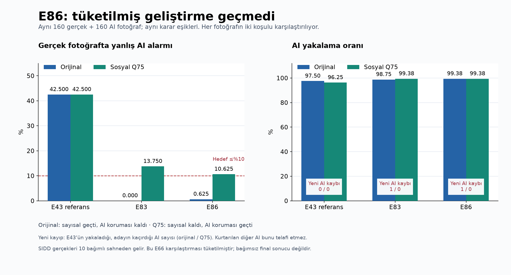

# PixelProof geliştirme ve GitHub onarım raporu — 13 Eylül 2026

GitHub hatasının kaynağı web bağımlılıklarındaki güvenlik açıklarıydı. Yerel onarım ve
kontroller tamamlandı ve `57aaf61` onarım commit’i GitHub main dalına gönderildi.
Bu kayıt anında [uzak CI çalıştırması](https://github.com/EfeHanKeles346/ai-image-detector/actions/runs/34749429187)
sırada bekliyor; uzaktaki sonuç henüz başarılı olarak doğrulanmadı.
Araştırmada gerçek fotoğrafların yanlış AI işaretlenmesi belirgin azaldı, ancak kabul
hedefi henüz sağlanmadı. E86 adayını bu nedenle yayına almadım.

## GitHub hatası ve yapılan düzeltme

[Başarısız CI çalıştırmasında](https://github.com/EfeHanKeles346/ai-image-detector/actions/runs/34748481696)
Python kontrolleri ve web işlev testleri geçmişti. `npm audit` toplam **11 açık**
(1 kritik, 8 yüksek, 2 orta) nedeniyle işlemi durduruyordu. Kritik Next.js açığı için
[üreticinin güvenlik kaydı](https://github.com/advisories/GHSA-2xp9-vwfh-vxw4)
incelendi. Bağımlılıklar uyumlu sürümlere taşındı:

| Paket | Önce | Sonra |
|---|---|---|
| Next.js | 16.3.2 | 16.3.5 |
| vinext | 0.0.50 | 1.0.0-beta.9 |
| RSC Vite eklentisi | 0.5.26 | 0.5.34 |
| Cloudflare Vite eklentisi | 1.53.1 | 1.54.8 |
| Wrangler | 4.125.0 | 4.131.1 |
| Workers tipleri | 5.20260823.1 | 5.20260911.1 |
| eslint-config-next | 16.2.6 | 16.3.5 |

Uyumlu alt bağımlılıklar da kilit dosyasında güncellendi; son `npm audit` sonucu
**0 açık**. Kurulumda `--force` veya `--legacy-peer-deps` kullanılmadı.
CI güvenlik eşiği kritik seviyesinden yüksek seviyesine sıkılaştırıldı. Aynı dal için
eski ve yeni çalıştırmaların gereksiz üst üste binmesini engelleyen iptal kuralı eklendi.

vinext güncellemesi statik dosyaları `/_next/static/` altına taşıdı. Eski `/assets/`
beklentisi olan test ilk denemede bunu yakaladı. Test yeni önbellek sözleşmesine
uyarlandı; ayrıca HTML'in çağırdığı JS ve CSS dosyalarının derlemede bulunduğu kontrol
ediliyor. Test kapatılmadı. vinext hâlâ beta sürümü; derleme ve SSR kontrolleri bu
geçişi kapsıyor, kapsamlı tarayıcı etkileşim testi yapılmadı.

Yerelde derleme, lint, TypeScript ve **6/6 web testi** geçti. Temiz `npm ci` kurulumu da 0 açıkla tamamlandı. Onarım sonrasında tam Python
paketi tekrar çalıştırıldı: **856 test geçti** (17,01 saniye; mevcut bir Starlette
kullanımdan kaldırma uyarısı). GitHub Linux/Node22/Python3.13 üzerinde ayrıca doğrulanacak.
[Onarım kanıtı](../evidence/ci_dependency_repair_2026-09-13.json).

## Model geliştirmesinde ulaşılan sonuç

Aşağıdaki değerler aynı **tüketilmiş geliştirme kümesindeki** 160 gerçek ve 160 AI
ana görsele aittir; iki dönüşümle 640 görünüm vardır. Bunlar yeni ve bağımsız final
test sonucu değildir. Gerçek taraftaki SIDD verisi yalnızca 10 bağımlı sahne içerir.

| Ölçüm | E43 referans | E83 | E86 son aday |
|---|---:|---:|---:|
| Orijinal gerçek fotoğraf yanlış AI oranı | %42,500 | %0 | **%0,625 (1/160)** |
| Sosyal/JPEG75 gerçek fotoğraf yanlış AI oranı | %42,500 | %13,750 | **%10,625 (17/160)** |
| Orijinal AI yakalama | %97,500 | %98,750 | **%99,375 (159/160)** |
| Sosyal/JPEG75 AI yakalama | %96,250 | %99,375 | **%99,375 (159/160)** |
| E43'ün yakalayıp adayın kaçırdığı orijinal AI | — | 1 | **1** |
| Sayısal kabul kontrolleri | — | 17/20 | **17/20** |

E86, E83'e göre sosyal dönüşümde 5 gerçek fotoğraf hatasını ve orijinalde 1 AI
hatasını düzeltti; orijinalde 1 gerçek fotoğraf yeniden yanlış işaretlendi. Toplam AI
yakalama yükselse de E43'ün yakaladığı **bir GPT görseli hâlâ kaçıyor**. Bu, “AI
yakalamayı düşürmeme” şartımızı ihlal ediyor; başka AI kazanımlarıyla gizlenmedi.

Sosyal dönüşümde gerçek hata oranı hedefi ≤%10 iken %10,625; en kötü gerçek kaynak
hedefi ≤%20 iken %21,212; kararlı kararların doğruluğu hedefi ≥%95 iken %94,194.
Bu üç kapı ve AI koruma şartı nedeniyle **E86 reddedildi**. E49 final/regresyon
verisi bu geceki deney zincirinde açılmadı. E20 servis modeli ve E43 araştırma
referansı değişmedi; eşikler ve kabul kuralları gevşetilmedi.

[DEV sonuçları](../evidence/e86_development.json) ·
[TRAIN sonuçları](../evidence/e86_fit.json) ·
[Model kartı](../MODEL_CARD.md).

## Tamamlanan deney ve veri işleri

- Önceki doğrusal ve çoklu özellik denemeleri, eğitim kapılarını veya geliştirme
  kümesindeki gerçek hata/AI koruma şartlarını geçemediğinde reddedildi. DEAR
  özellikleri ve denetimli temsil çalışması E83'e ulaştırdı; yüksek eğitim başarısı
  geliştirme başarısı olarak sunulmadı.
- **E84B:** 12.141 TRAIN ana görseline 1080 piksel sınırı ardından JPEG75 dönüşümü
  eklendi. Önceki kaynak çözünürlüğünde JPEG75 ile aynı işlem olmadığı doğrulandı.
  Özellik çıkarımı yaklaşık 2 saat 2 dakika sürdü.
- **E85:** Dört koşuldaki 48.564 görünümle sabit mimari ve 100 epoch temsil eğitimi
  yaklaşık 75 saniyede tamamlandı. Çok düşük eğitim kaybı genelleme kanıtı sayılmadı.
- **E86:** Kısıtlı başlık eğitimi ve çalışma zamanı kontrolü yaklaşık 236 saniye
  sürdü; 80/80 TRAIN ölçütü ve eğitim AI korumaları geçti. Ardından ayrı DEV
  değerlendirmesinde yukarıdaki nedenlerle reddedildi.
- **E87–E88:** Resmî SID kaynağından skor körü seçilmiş 64 Sony + 64 Fuji uzun
  pozlamalı RAW indirildi. Yaklaşık 3,38 GB sıkıştırılmış aktarım yapıldı; RAW boyutu
  yaklaşık 4,85 GB. 128 görselin tümü çözüldü; 151.996 korunan referansla denetimde
  eşleşme ve iç tekrar bulunmadı. Tam arşivlerin indirilmesi gerekmedi.
- **E89:** Bu 128 TRAIN görselinin dört koşulda DINO/CLIP/DEAR özellikleri tamamlandı.
  İlk başlatmada çevrimdışı bayrakların geç ayarlanması ağ korumasına takıldı; işlem
  ortamında erken ayarlanan bayraklarla aynı sabit sözleşme yeniden çalıştırıldı.
  Başarılı çıkarım yaklaşık 566 saniye sürdü. Bu aşamada SID model skoru üretilmedi.
- **E91/E92:** 12.269 ana görsel ve 49.076 görünüme genişleme kodu hazırlandı.
  Önceki grupları koruyan 120 TRAIN kontrolü, veri rolü/tekrar korumaları ve
  başarısız TRAIN sonrasında DEV erişimini durduran testler eklendi. **Sözleşme
  dondurulmadı, eğitim ve yeni DEV değerlendirmesi yapılmadı.**

[Gece çalışma günlüğü](../evidence/overnight_2026-09-13.md) ·
[Deney kayıtları](../ml/EXPERIMENTS.md) · [Güncel plan](../PLAN.md).

## Sonraki araştırma adımı ve sınırlar

GitHub onarımı ve bu rapor tamamlandıktan sonraki araştırma adımı, E91/E92'nin tek
veri kapsamı genişlemesi olarak ayrı kayda alınmasıdır. Mimari, amaç fonksiyonu,
eşik ve seed aynı anda değiştirilmemeli. Önce tüm TRAIN ve AI korumaları, ardından
aynı kurallarla DEV geçmeli; başarısız aday final verisine ilerlememeli.

Yeni SID verisinin hatayı çözeceğine dair henüz deney sonucu yok. SID kamera/dosya
grupları bağımsız sahne kanıtı değil. MIDD/DEAR araştırma kullanım sınırları ve RR
verisinin eksik kaynak izleri devam ediyor. Ham veri ve ağırlıklar harici diskte;
GitHub'a kod, plan, günlük ve küçük sonuç kanıtları gönderiliyor.
