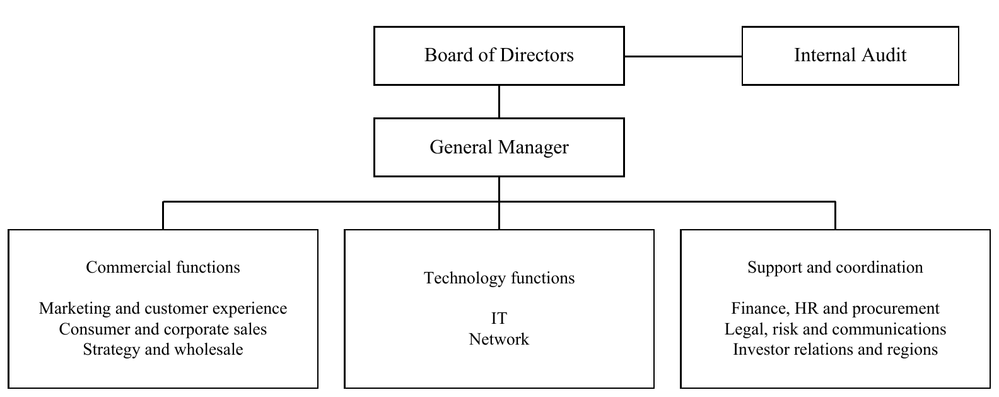
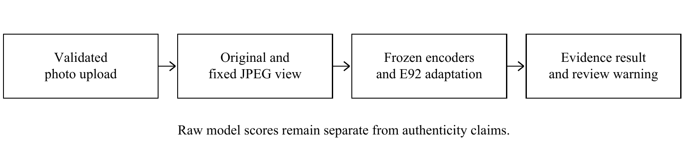
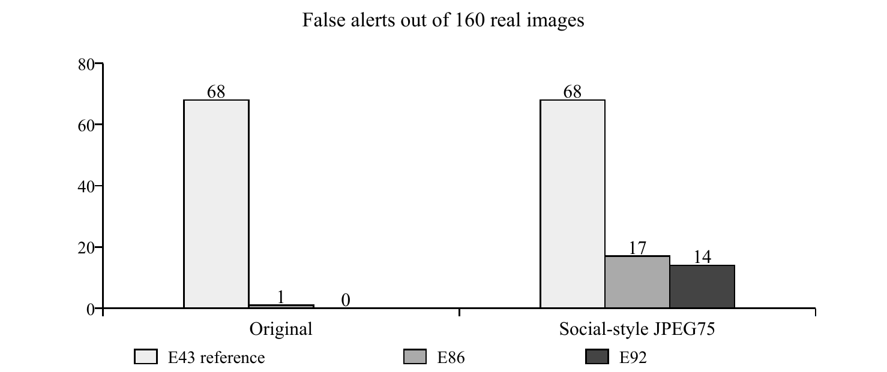

# PixelProof AI Image Detection and Reliability Evaluation

## Abstract
Türk Telekom provides telecommunications and digital services across Türkiye. During my CS395 internship, I developed PixelProof as a research prototype for examining whether an image contains evidence of AI generation. A second, experimental module investigated where a local AI edit might occur. The work combined dataset auditing, machine learning experiments and a local web demonstration. Early models performed well on familiar data but failed on different image sources. Subsequent work therefore emphasized correct labels, separated data roles, processing robustness and reproducible evaluation. The E92 model detected 159 of 160 AI images in each of two conditions on a repeatedly used development set. False alerts on 160 real images decreased from 68 to zero for original inputs and from 68 to 14 after a fixed resizing and JPEG transformation, compared with the E43 reference. E92 met all 20 numerical development criteria but still missed one original AI image previously detected by E43, so it failed the complete acceptance contract. Later source-separated diagnostics and localization experiments exposed additional limitations. The completed deliverables include trained research artifacts, a guarded web demo, experiment and dataset records, and automated software checks. The project demonstrates a working, traceable prototype and substantial improvement on a defined development collection. It does not establish universal detection or production readiness. Future work should prioritize genuinely independent sources, calibration separated from evaluation and broader localization tests before stronger claims.

# 1. Introduction

PixelProof addresses a practical question: can a system identify evidence of AI generation without routinely accusing genuine photographs? Visually convincing generated images make this task difficult, while resizing and compression can change the signals available to a detector. The project also explored a related question: can a model locate a small AI-edited region inside an otherwise genuine photograph? These are different tasks and require different evidence.

The internship ran from 20 July to 18 September 2026 under the approved 40-day CS395 arrangement at Türk Telekom. This report covers the technical record through 16 September, the latest completed research checkpoint before the end of that period. Report preparation took place afterwards. Experiment identifiers refer to recorded protocols and findings, rather than a count of independent trials. The implementation and append-only records provide the primary evidence for project-specific claims (Keleş, 2026).

The main achievement is a functioning research system with measurable development improvements, a usable local interface and an evaluation process that also records failures. The strongest current demonstration uses E92. Its success is qualified: it satisfies 20 numerical checks on reused development observations, but fails a separate rule that protects previously detected AI examples. Independent universal reliability remains unproven.

Section 2 introduces the host organization. Section 3 explains the problem and relevant literature. Section 4 describes responsibilities, methods, implementation, representative experiments and results. Section 5 discusses learning and difficulties. Sections 6 and 7 give conclusions and recommendations. References and a compact evidence appendix support the main account without reproducing every experiment or implementation detail.

# 2. Company information

## 2.1 Corporate profile and services

The host organization is Türk Telekomünikasyon A.Ş. Its registered office is Turgut Özal Bulvarı, 06103 Aydınlıkevler, Ankara. The corporate website is https://www.turktelekom.com.tr. The internship contact supplied in the approved record is +90 312 555 93 92. The actual internship office address remains [TO COMPLETE: internship office], which must not be confused with the registered headquarters (Türk Telekom, 2026a).

Türk Telekom has a history extending over 185 years. It adopted an integrated operating structure in 2015 and brought mobile, internet, telephone and television services under one brand in 2016. Its facilities are communications infrastructure, service operations and offices rather than a manufacturing plant. The corporate profile reports operations in 81 provinces and 31,756 employees alongside its 30 June 2026 operating figures (Türk Telekom, 2026b).

The group supplies fixed access, broadband, mobile, television and corporate data services. Customers include households, businesses and wholesale operators. Group companies include TT Mobil, TTNET, Argela, İnnova, SEBİT, AssisTT and Türk Telekom International. The disclosed ownership structure allocates 60% to Türkiye Wealth Fund, 25% to the Ministry of Treasury and Finance and 15% to publicly traded shares. The fund also holds 1.68% within the publicly traded portion; that holding must not be added to the 100% ownership total (Türk Telekom, 2026a, 2026b).

The company operates in the telecommunications market, with competition across mobile and fixed connectivity. A host-confirmed account of the main competitors and major suppliers relevant to the internship unit remains [TO COMPLETE: relevant competitors and suppliers]. No supplier ranking or customer account has been inferred from the project. PixelProof used research datasets and public pretrained components, not customer telecommunications records.

## 2.2 Organization and internship context

Figure 1 summarizes the corporate reporting structure published in the 2025 Annual Report. It retains the distinction between functions reporting to the general manager and internal audit reporting to the board. Functional descriptions are summarized from the published department titles. The diagram is corporate context and does not assign my internship to an unconfirmed unit (Türk Telekom, 2026a, p. 33).

Figure 1. Simplified corporate reporting structure from the 2025 Annual Report.

Network and IT cover communications infrastructure and information systems. Commercial functions include customer experience, consumer sales, corporate sales and wholesale services. Support functions include finance, people operations, procurement, legal compliance and risk. Regional directorates coordinate local operations. The specific host unit and its place in this structure remain [TO COMPLETE: department and reporting line].

# 3. Project background

## 3.1 Department information

The approved company supervisor is Önder Çelebi. The supplied contact is onder.celebi@turktelekom.com.tr. His title is [TO COMPLETE: supervisor title]. The department is [TO COMPLETE: department name and responsibilities]. Other close collaborators, their titles and work email addresses are [TO COMPLETE: collaborators, or confirm none]. These fields have deliberately been left open pending confirmation.

The approved arrangement was hybrid, with Monday through Thursday on site and Friday remote. The project record concerns a student research prototype. It does not establish that Türk Telekom already operated this detector, requested a particular production deployment, or used its outputs in customer decisions. Any department-specific business process description requires confirmation before submission.

## 3.2 Initial project status

The first recorded experiment on 20 July used a small convolutional neural network trained on CIFAKE. The initial workflow was conventional: prepare labelled images, train a classifier, evaluate it and inspect mistakes. A 96.75% result on the familiar test collection initially looked promising, but accuracy fell to 77.1% on a separate 995-image collection. Later auditing also exposed confounds in that external collection. These historical values describe early diagnostics, not a certified deployment benchmark (Keleş, 2026, E1 and E10).

Information flowed from dataset sources to local preparation and training scripts, then to saved scores, error analysis and experimental decisions. The work evolved from improving a single accuracy number into controlling what data meant, which populations could influence learning, and how results should reach a user. There was no verified production decision process to replace.

## 3.3 Motivation and problem definition

The objective was to build and evaluate an image-screening prototype that could find AI-related evidence while limiting false alarms on real photographs. A false positive labels a real image as AI. A false negative misses an AI image. Reducing only one of these errors can make the other worse, so both must remain visible.

The central technical problem was distribution shift: images from a new camera, generator or processing pipeline could behave very differently from the training examples. A separate localization objective required pixel-level evidence about edited regions. An image-level score alone cannot establish that a highlighted area was edited, and a low score cannot prove that an image is authentic.

## 3.4 Related literature

Wang et al. (2020) studied transfer from a detector trained on one generator to several other synthesis methods. Ojha et al. (2023) showed that pretrained visual representations can support broader fake-image detection with simple classifiers. These studies motivated comparison of learned representations with the early convolutional and handcrafted baselines. Their published results belong to their own protocols and are not PixelProof measurements.

CLIP learns visual representations from image-text supervision (Radford et al., 2021). DINOv2 learns reusable visual features without task-specific labels (Oquab et al., 2024). PixelProof used such pretrained representations and trained adaptation components around them. The contribution is therefore not training an entire foundation model from scratch. It lies in data preparation, learned adaptation, evaluation and integration.

Grommelt et al. (2024) show how compression and image-size differences can become shortcuts in generated-image detection datasets. This matters because matching file extensions or resizing every image does not erase previous processing. PixelProof investigated processing history and matched transformations, while avoiding claims that cropping automatically removes source bias.

Kim et al. (2026) introduce DEAR, using inpainting-related analysis to prune features that are less robust to processing. PixelProof incorporated a pinned pretrained DEAR component alongside other visual features. A published claim about unseen-generator robustness cannot be inherited merely by loading those weights. Local data lineage and task-specific evaluation remain necessary.

SIDD supplies smartphone denoising data from ten scenes and five cameras (Abdelhamed et al., 2018). SID supplies paired short- and long-exposure low-light raw images (Chen et al., 2018). They provided documented real-image coverage, but neither is a survey of all current phone photography. Multiple observations from a scene remain dependent, and a research raw rendering need not match a consumer camera JPEG.

Guo et al. (2017) distinguish classifier outputs from well-calibrated confidence estimates. That distinction informs the interface: multiplying a score by 100 does not make it a probability of AI generation. Dwork et al. (2015) explain the risk of adaptively reusing holdout data. PixelProof therefore identifies previously inspected collections as development evidence even when individual runs freeze their settings before scoring.

# 4. Internship project

## 4.1 Project objective and scope

Model1 aimed to detect image-level AI evidence across a wider range of real and generated photographs while preserving detection of AI images already caught by a reference model. Model2 investigated localization of AI edits with ground-truth masks. The practical deliverable was a local student demonstration with clear uncertainty handling, backed by reproducible research records.

The scope included source auditing, training and comparison of candidate models, original-versus-processed evaluation, software validation and readable outputs. It excluded certification of authenticity, unrestricted commercial deployment and a guarantee against all future generators. Classical splicing, generative editing and full-image generation were not treated as interchangeable labels.

## 4.2 My responsibilities

My project responsibilities covered defining the objectives, directing the experiment sequence, organizing the research material and reviewing the recorded results. The development process used AI coding assistance for implementation, analysis and documentation. Reproducible scripts, source checks and tests were used to verify outputs rather than treating generated explanations as evidence. The report distinguishes those engineering checks from proof that a model generalizes.

The project work included dataset acquisition and admission records, label mapping, duplicate and ancestry checks, model experiments, API and interface development, and maintenance of PLAN.md, HISTORY.md, ml/EXPERIMENTS.md and DATASETS.md. Responsibilities of other people remain [TO COMPLETE: confirmed team roles]. Public pretrained encoders and external datasets are acknowledged separately from the project-owned adaptation and application code.

## 4.3 Methodology and tools

Experiments followed a recorded hypothesis, a fixed population and configuration, execution, saved results and an explicit disposition. TRAIN supplied learning data. Calibration selected an operating rule. DEVELOPMENT exposed weaknesses and guided further work. A protected final collection was not treated as another tuning resource. These roles describe permissible use, not simply folder names.

Python, PyTorch, NumPy, SciPy and scikit-learn supported modelling and analysis. The local interface used React and TypeScript with a FastAPI inference service. Git preserved implementation history, while automated Python and web checks supported reproducibility. Model artifacts and important input records were bound to cryptographic hashes. Table 1 distinguishes these components by purpose.

Table 1. Main tools and their roles in the project.
Component | Purpose
--- | ---
PyTorch and pretrained encoders | Visual features and learned adaptation
NumPy, SciPy and scikit-learn | Feature transforms, optimization and metrics
FastAPI | Validated local inference requests
React and TypeScript | Uploads and understandable result display
Git and GitHub Actions | Version history and automated checks

## 4.4 Expected outcomes and deliverables

The intended outcome was a demonstrable image-screening workflow supported by traceable measurements. Deliverables include trained research artifacts, command-line experiments, a local web demo, dataset provenance records and aggregate evidence files. Model2 contributes an experimental localization evaluator and controlled tests. A production-ready universal detector was an aspiration, not a completed deliverable.

## 4.5 Project details

### 4.5.1 Early models and the first transfer failures

The first phase compared a small CNN, classifiers on frozen embeddings and a pretrained ResNet-18. On the familiar CIFAKE test, the ResNet result improved to 97.66%, yet its accuracy on the 995-image external collection fell to 25.2%. A control that reproduced the training resolution bottleneck recovered much of the loss. This showed that a stronger architecture could still fail when image preparation changed (Keleş, 2026, E1–E6).

Later experiments used native-resolution data, image statistics and tile-based features. The goal was to retain fine detail without allowing dimensions or processing history to dominate the decision. Some specialist methods helped particular sources but harmed others. Simple averaging of model scores did not supply a consistently better detector. These comparisons redirected the work toward source coverage and evaluation design rather than selecting the most impressive isolated score.

The early conclusions also required correction. Fixed-size crops do not automatically make a biased dataset safe, and a plausible physical explanation does not prove what a learned model uses. Later notes explicitly qualified the original camera-noise and preprocessing assumptions. The report follows those corrections rather than repeating the strongest early wording.

### 4.5.2 Data integrity and corrected conclusions

A major audit found that two source datasets used the opposite numeric label convention from the project. PixelProof defines 0 as real and 1 as AI, but raw source labels had entered a shared pool without translation. The error affected several earlier experiments. The remedy was an explicit source-to-project label mapping, checks against declared label names, rebuilt indices and reruns of affected experiments (Keleş, 2026, E19b–E19c).

One consequence was especially instructive: a DINOv2 result previously interpreted as near chance on Defactify changed from AUC 0.480 to 0.764 after label correction. The original explanation for failure was therefore withdrawn. This was a data-semantics error, not an architectural discovery. The record preserves the mistake and the correction so later conclusions do not silently inherit invalid evidence.

A separate E27 audit found that a threshold-selection procedure could consult evaluation data. The corrected procedure used only calibration data before evaluation. The revised candidate then failed its admission requirement and was removed from the serving path. These corrections establish why the provenance of a score matters as much as its size.

### 4.5.3 Data roles and processing conditions

Each source was documented with its origin, intended role, licensing status and integrity checks. Acquired bytes were not automatically admitted into training. Exact identities, available perceptual matches and known parent, scene or prompt relationships informed grouping. Unresolved ancestry was retained as a limitation rather than replaced by an independence assumption.

E92 used 12,269 training parent images, comprising 7,674 real and 4,595 AI examples. Four processing conditions produced 49,076 views. Later research expanded the real population to 7,930, giving 12,525 parents and 50,100 views. These later counts must not be attributed to the earlier E92 fit. Table 2 separates the main populations (Keleş, 2026, E92 and E139).

Table 2. Distinct populations and their permissible interpretation.
Population | Parents | Views | Role
--- | --- | --- | ---
E92 training | 12,269 | 49,076 | Training
E66 comparison | 320 | 640 | Reused development
Later source-fold research | 12,525 | 50,100 | Internal diagnostics
Model2 controlled pilot | 16 | 192 in E135 | Adaptive development

The four training conditions were clean input, an assigned transport transformation, JPEG quality 75 and a social-style transformation that limited the longest side to 1080 pixels before JPEG quality 75 encoding. The development comparison used original and social-style views of the same 320 parents. More transformed views improve coverage of a processing question, but do not create more independent photographs.

### 4.5.4 E92 representation and learning

E92 combines frozen DINOv2, CLIP and DEAR features with earlier learned components and a supervised representation. A constrained correction head then adjusts the reference decision score. The optimization emphasized difficult real-image sources while protecting training AI responses. Constraints on training examples are useful safeguards, but they do not guarantee the same protection on a different population.

Figure 2 shows the application-level information flow. It deliberately separates frozen pretrained components, project adaptation and the interface decision. The browser receives a validated response rather than fitting a model. The local service verifies required artifacts and uses the original image plus a fixed processed view. No file name or camera declaration is an automatic authenticity rule.

Figure 2. PixelProof inference flow and separation of model evidence from display policy.

This architecture is a composite research system. Referring to it as one downloadable universal model would conceal its dependencies, provenance limits and licensing conditions. E92 is the identifier of a frozen candidate, not a percentage score or a count of training epochs.

### 4.5.5 Development improvement and acceptance limits

Figure 3 compares false alerts on exactly the same real development images. E92 reduced original-view false alerts from 68 of 160 for E43 to zero, and processed-view false alerts from 68 to 14. E86 was the preceding intermediate candidate. The comparison is paired and descriptive; it is not an independent estimate for all future photographs.

Figure 3. Real-image false alerts on the reused development set, with 160 real images per condition.

E92 detected 159 of 160 AI images in each condition. It passed ten numerical requirements for originals and the same ten for processed views. However, it newly missed one original AI image that E43 had caught. Other recovered AI images could not cancel that loss under the predeclared retention rule. Consequently, the complete acceptance contract failed despite the 20/20 numerical milestone.

The development collection contains 160 real observations from only ten SIDD scenes and 160 AI images from two previously seen families. Repeated use influenced later research choices. The result therefore supports progress on this collection, while leaving adaptive selection bias and unseen-source reliability unresolved. Thirteen of the fourteen processed real false alerts concentrate in two scenes, which also shows why a pooled rate can conceal weaknesses.

### 4.5.6 Honest scores and the web demonstration

The local demonstration presents AI evidence, no clear AI evidence or an uncertain result. It does not certify an image as real. E92 uses an upper raw-score cut of 0.07940196245908739 and a lower cut of 0.011505939625203613. On the interface these correspond approximately to 7.94 and 1.15 on a 0–100 score scale. They are inherited experimental operating points, not calibrated probabilities or universal optima.

An original score at or above the upper cut keeps an AI alert visible. If both E92 views are below the lower cut, the interface reports no clear signal. Other cases need uncertainty handling. An original AI alert with disagreement can carry a review warning. E43 supplies a separate advisory and no longer vetoes two low E92 scores. Thus the final paired display cannot be reconstructed from one displayed percentage or from an assumed 50% boundary.

The current-policy audit of the reused 320-parent collection recorded 139 no-clear results and 21 uncertain results among real images, with no real AI alerts. Among AI images it recorded 159 AI alerts and one uncertain result. This is a different endpoint from the per-view classification rates. It must not be presented as 100% accuracy among all uploads, and the gallery has different errors (Keleş, 2026, current-policy audit).

Software protection includes upload bounds, supported-image checks, explicit unavailable responses, response-schema validation and preservation of the single heavy-worker slot during request cancellation. A pinned manifest is verified before model deserialization. These changes reduce implementation failure risk, but they do not measure detection accuracy.

### 4.5.7 Broader checks and rejected improvements

The owner-gallery diagnostic found 9 false AI alerts among 206 unique original real-image byte identities, rising to 18 after social-style processing. These correspond to 4.37% and 8.74%. The collection is dominated by one phone and correlated scenes, and had been inspected before. It is useful evidence of practical failure modes, but does not supply an independent deployment test. Private photographs and per-image identifiers are not reproduced here (Keleş, 2026, E95).

Later research compared fresh diagnostic heads using source-separated folds. E146 tested calibration on one source fold and evaluation on another. Three of six calibration assignments were feasible, but no assignment met the full evaluation conditions. These were separate diagnostic models, not changes to E92. The result rejects that tested calibration recipe rather than proving that all calibration is impossible.

E148 found a processing imbalance in the existing training collection: known 224-pixel derivatives represented 29.18% of real images and 7.68% of AI images. Such differences are possible shortcuts, not evidence of a specific causal mechanism. E150B successfully extracted new source-pixel features for all 12,525 parents after a memory-safe implementation amendment.

Adding those features in E151 slightly improved clean aggregate recall but lowered AI recall in all three transported conditions. For example, the center-control comparison changed JPEG75 AI recall from 75.73% to 74.15%. E152 then decomposed the fixed score changes without retraining: the added residual term was the largest harmful change in 94 of 131 newly missed JPEG75 AI views. The candidate remained rejected. That count describes an error subset, not a detection rate or proof that removing the term would solve the problem.

### 4.5.8 Model2 localization and its limits

Model2 compares predicted regions with intended edit masks, using authentic and conventional-edit controls. Early overlap scores were misleading because selecting the predicted area from the true mask size could reward large masks without useful localization. Later experiments separated mask information from inference.

The recent controlled pilot used sixteen previously inspected parents and one Stable Diffusion 1.5 editor. A frozen local head obtained mean pixel AUC 0.742 on the original placement, but only 0.566 when edits moved to new locations. Training on both placements increased the new-location value to 0.638, while reducing the original-placement value to 0.699. Authentic falsely flagged area increased from 17.11% to 25.74%. Table 3 shows the original-image condition (Keleş, 2026, E132–E135).

Table 3. Model2 placement sensitivity on sixteen consumed parents, original-image condition.
Endpoint | Earlier head | Two-placement head
--- | --- | ---
Original-placement pixel AUC | 0.742 | 0.699
New-placement pixel AUC | 0.566 | 0.638
Authentic falsely flagged area | 17.11% | 25.74%

The candidate was rejected because improvements introduced other errors. Moving masks also changes edited content, so this is not pure causal proof of location bias. Model2 remains experimental and needs independent parents and more editors.

## 4.6 Results

The project delivered a trained E92 research system, a local web demonstration and a reproducible record of model development and rejection. Table 4 reports the central E92 per-view outcome at the fixed upper cut. The parent collection is reused development data, with 160 real and 160 AI images per condition. These rates do not describe the paired interface policy.

Table 4. E92 per-view results on the reused E66 development collection.
Measure | Original | Social-style
--- | --- | ---
AI detection | 159/160 (99.38%) | 159/160 (99.38%)
Real false alerts | 0/160 (0.00%) | 14/160 (8.75%)
Balanced accuracy | 99.69% | 95.31%
Numerical criteria | 10/10 | 10/10
New AI misses versus E43 | 1 | 0

The 20 numerical checks passed, but full acceptance failed because of the one new original AI miss. Universal reliability and independent final-test success were not achieved. Model2 did not qualify as a reliable localization service. The latest recorded engineering checkpoint passed 1,245 Python tests; this measures software checks, not 1,245 successful image classifications. There is no measured company deployment impact or production rollout commitment. The completed outcome is a student research prototype with documented limitations (Keleş, 2026).

# 5. Internship experience

## 5.1 Learning

The strongest technical lesson is that a working pipeline and a high score answer different questions. A model may run correctly and still fail on unfamiliar sources. Conversely, a rejected model can produce useful knowledge when its hypothesis, data and errors are documented. The label-direction correction demonstrated why a convincing explanation should not be accepted before the underlying measurement is checked.

The work also provided practice in reading research papers critically, separating a method from its published performance claim, and maintaining reproducible records. Cached features made repeated analysis possible within local hardware limits. User-facing uncertainty required careful wording because a raw score can easily be misunderstood as confidence. [TO COMPLETE: personal learning reflection and whether this experience changed career plans.]

## 5.2 Relation to undergraduate education

Three undergraduate foundations connect directly to the technical work. Probability and statistics support conditional error rates, sample dependence and interpretation of uncertainty. Linear algebra and optimization support feature vectors, projections, principal components and fitted classification heads. Software engineering supports modular interfaces, tests, version control and reproducible builds. These connections explain the methods used without claiming that a particular course covered every advanced technique.

More preparation in experimental design and data provenance would have been particularly useful. A dataset can contain valid files but inconsistent meanings, and a test can contain different files while still sharing scenes or generation ancestry. [TO COMPLETE: confirm the three course connections and personal preparation needs against actual coursework.]

## 5.3 Major difficulties

The first difficulty was unreliable transfer across sources. Strong internal scores did not prevent false alarms on unfamiliar real photographs. The response was to expand documented source coverage, report errors by group and distinguish training, calibration and evaluation. The generalization problem remains partly unresolved, so the report records the response without claiming a complete solution.

The second difficulty was trustworthy measurement. Reversed source labels and an evaluation-dependent threshold procedure changed the meaning of earlier results. Explicit label mapping, isolated calibration and reruns corrected the affected evidence. The history retained both original and corrected conclusions, making the correction auditable.

The third difficulty was running a multi-component research system within local resource and reliability limits. Feature caching, bounded batches and resource guards helped. An E150 memory failure led to a separately recorded, pixel-equivalent implementation amendment, E150B. Runtime checks addressed cancellation and artifact-manifest handling without changing the scientific model. These are concrete engineering repairs rather than proof of better detection.

## 5.4 A typical day

The approved schedule was Monday through Thursday on site and Friday remote. The documented work cycle was to review the plan, audit or implement a change, run a bounded experiment, interpret results and update the records.

[TO COMPLETE: add a personally verified account of a typical on-site day and team communication. The repository establishes the technical workflow, not actual meetings or attendance hours.]

# 6. Conclusions

PixelProof progressed from early classifiers with large source-transfer failures to a working research demo with strong results on a defined development collection. E92 reduced real-image false alerts while maintaining high aggregate AI detection in that collection. The interface now distinguishes a model signal from an authenticity claim and separates the main model from an advisory reference.

The central scientific conclusion is qualified. Passing 20 numerical development checks did not satisfy the full acceptance contract or establish universal performance. A reference-relative AI miss remained, development reuse limited independence, and later diagnostics exposed processing and source failures. Model2 also remained experimental because localization gains introduced other errors.

The durable outcome is both an implemented prototype and a traceable method of evaluating it. Data corrections, rejected hypotheses and runtime repairs are part of that outcome. They support a credible student engineering project while identifying exactly which claims need further evidence.

# 7. Recommendations

Future internship students should establish dataset meanings, permissible data roles and error metrics before a long training run. They should learn to reproduce a saved result and inspect individual changes, since a better average can hide newly harmed examples. Basic familiarity with version control, Python testing and the host organization’s data rules would reduce avoidable delays.

For this project, the next research priority is an explicitly independent and sufficiently diverse evaluation design. Source ancestry, scene dependence and generator coverage should be resolved before claiming independence. Calibration must remain separate from evaluation, and operating costs should determine a prospectively chosen decision policy. Model2 needs more independent parents and editors together with authentic and conventional-edit controls.

In the workplace, students should agree on scope and review expectations with their supervisor, record incomplete work honestly and protect personal or restricted data. Results should be communicated in plain language: what changed, which population supports the finding and what still fails. AI coding assistance can accelerate work, but the student must understand and verify what will be submitted and presented.

# 8. References

Abdelhamed, A., Lin, S., & Brown, M. S. (2018). A high-quality denoising dataset for smartphone cameras. Proceedings of the IEEE Conference on Computer Vision and Pattern Recognition. Retrieved September 25, 2026, from https://abdokamel.github.io/sidd/

Chen, C., Chen, Q., Xu, J., & Koltun, V. (2018). Learning to see in the dark. Proceedings of the IEEE Conference on Computer Vision and Pattern Recognition. Retrieved September 25, 2026, from https://cchen156.github.io/SID.html

Dwork, C., Feldman, V., Hardt, M., Pitassi, T., Reingold, O., & Roth, A. (2015). Generalization in adaptive data analysis and holdout reuse. Advances in Neural Information Processing Systems, 28. Retrieved September 25, 2026, from https://proceedings.neurips.cc/paper/2015/hash/bad5f33780c42f2588878a9d07405083-Abstract.html

Grommelt, P., Weiss, L., Pfreundt, F.-J., & Keuper, J. (2024). Fake or JPEG? Revealing common biases in generated image detection datasets. arXiv:2403.17608. Retrieved September 25, 2026, from https://arxiv.org/abs/2403.17608

Guo, C., Pleiss, G., Sun, Y., & Weinberger, K. Q. (2017). On calibration of modern neural networks. Proceedings of Machine Learning Research, 70, 1321–1330. Retrieved September 25, 2026, from https://proceedings.mlr.press/v70/guo17a.html

Keleş, E. H. (2026). PixelProof experiment, history and dataset records [Software and research records, commit 497d45c]. GitHub. Retrieved September 25, 2026, from https://github.com/EfeHanKeles346/ai-image-detector/tree/497d45c

Kim, D., Choi, J., Seong, H. S., Kim, S., Lee, D., Yi, S., & Choi, J.-H. (2026). Dissect and prune: Enhancing robustness in AI-generated image detection. ICML 2026; arXiv:2606.10309, version 2. Retrieved September 25, 2026, from https://arxiv.org/abs/2606.10309v2

Ojha, U., Li, Y., & Lee, Y. J. (2023). Towards universal fake image detectors that generalize across generative models. Proceedings of the IEEE/CVF Conference on Computer Vision and Pattern Recognition, 24480–24489. Retrieved September 25, 2026, from https://arxiv.org/abs/2302.10174

Oquab, M., Darcet, T., Moutakanni, T., Vo, H., Szafraniec, M., Khalidov, V., Fernandez, P., Haziza, D., Massa, F., El-Nouby, A., Assran, M., Ballas, N., Galuba, W., Howes, R., Huang, P.-Y., Li, S.-W., Misra, I., Rabbat, M., Sharma, V., Synnaeve, G., Xu, H., Jégou, H., Mairal, J., Labatut, P., Joulin, A., & Bojanowski, P. (2024). DINOv2: Learning robust visual features without supervision. Transactions on Machine Learning Research. Retrieved September 25, 2026, from https://arxiv.org/abs/2304.07193

Radford, A., Kim, J. W., Hallacy, C., Ramesh, A., Goh, G., Agarwal, S., Sastry, G., Askell, A., Mishkin, P., Clark, J., Krueger, G., & Sutskever, I. (2021). Learning transferable visual models from natural language supervision. Proceedings of Machine Learning Research, 139, 8748–8763. Retrieved September 25, 2026, from https://proceedings.mlr.press/v139/radford21a.html

Türk Telekom. (2026a). 2025 annual report. Türk Telekom Investor Relations. Retrieved September 25, 2026, from https://www.ttyatirimciiliskileri.com.tr/media/dqsjlvxo/2025-annual-report.pdf

Türk Telekom. (2026b). Hakkımızda [About us; operating figures at June 30, 2026]. Retrieved September 25, 2026, from https://www.turktelekom.com.tr/hakkimizda/detay?p=tab3

Wang, S.-Y., Wang, O., Zhang, R., Owens, A., & Efros, A. A. (2020). CNN-generated images are surprisingly easy to spot... for now. Proceedings of the IEEE/CVF Conference on Computer Vision and Pattern Recognition, 8695–8704. Retrieved September 25, 2026, from https://arxiv.org/abs/1912.11035

# 9. Appendices

## 9.1 Development criteria

Table 5 lists the ten inherited numerical criteria, applied separately to original and social-style views. They are project-defined requirements, not an external certification standard. Automatic coverage and uncertainty are complementary, and several other metrics are correlated. The extra zero-new-reference-AI-miss requirement remains separate and failed for E92.

Table 5. E92 numerical development checks and their measured values.
Criterion | Requirement | Original | Social
--- | --- | --- | ---
Valid-score coverage | 100% | 100% | 100%
ROC-AUC | ≥0.90 | 0.9998 | 0.9942
Balanced accuracy | ≥85% | 99.69% | 95.31%
Pooled real false alerts | ≤10% | 0.00% | 8.75%
Worst real source | ≤20% | 0.00% | 18.75%
Pooled AI detection | ≥80% | 99.38% | 99.38%
Worst AI source | ≥60% | 98.75% | 98.75%
Automatic coverage | ≥80% | 98.75% | 98.44%
Accuracy when automatic | ≥95% | 99.68% | 95.24%
Uncertain fraction | ≤20% | 1.25% | 1.56%

## 9.2 Evidence and reproduction map

Table 6 maps the principal findings to compact repository evidence. The source snapshot is commit 497d45c. Large weights, datasets and private predictions remain outside Git. Reproducing an existing receipt is distinct from training a new candidate or opening a protected final collection.

Table 6. Primary project evidence for the report.
Finding | Repository evidence
--- | ---
E92 numerical result and failed retention | evidence/e92_development.json
Bias and readiness audit | evidence/e92_readiness_audit_2026-09-14.json
Current paired interface policy | evidence/project_audit_20260916.json
Owner-gallery aggregate results | evidence/e95_gallery_report.json
Model2 placement comparison | evidence/e135_location_learning.json
Processing imbalance | evidence/e148_processing_inventory.json
Residual-feature rejection | evidence/e151_source_pixel_comparison.json
Fixed-model score decomposition | evidence/e152_logit_decomposition.json

AI recall is TP divided by TP plus FN. Real false-positive rate is FP divided by FP plus TN. Balanced accuracy averages AI recall and real specificity. Automatic coverage is the fraction receiving an automatic decision; accuracy among those decisions excludes abstentions from its denominator. Pixel AUC ranks edited against unedited locations, while intersection-over-union measures overlap at a chosen map threshold. These quantities answer different questions and should not be exchanged.
